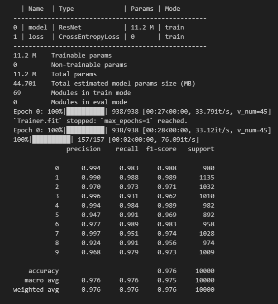

# 深度学习实战-3
本实践项目包含两个任务:  
1.采用lenet、vgg、resnet-18进行mnist图像分类。  
2.构建一个超级小的vision transformer网络，测试其在mnist上的准确度。 

## 依赖的包
- torch 2.4.0
- torchvision 0.19.0
- lightning 2.4.0

## 运行说明
LeNet.py、ReSNet.py、VGG.py文件可直接运行，输出中包含mnist数据集各类测试精度。vit.py文件可选择训练模式：**python vit.py --mode=train** 和测试模式:**python vit.py --mode=test**。

## 结果
**LeNet：**  
  
**VGG：**  
  
**ResNet：**  
  
**vit：**  
  
**vit_1：**
![vit_1]
